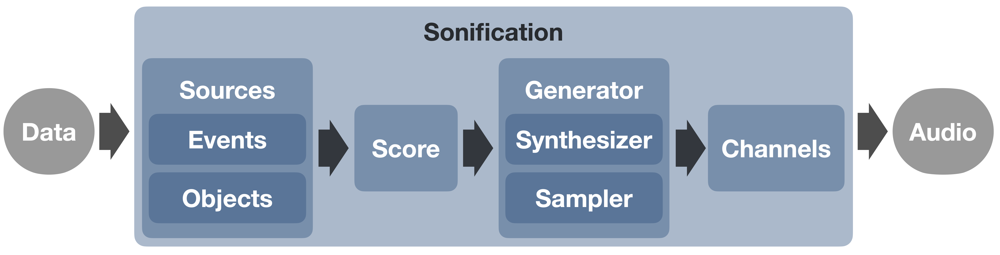

.. _elements:

Elements of a Strauss Sonification
^^^^^^^^^^^^^^^^^^^^^^^^^^^^^^^^^^

Strauss makes use of a number of internal Classes to produce the output audio. These handle broadly different aspects of the sonification process. For more in-depth documentation see the :code:`Detailed Documentation`.

Briefly, a :code:`Source` represents the data and the mapping of its variables onto aspects of sound. This is taken by the :code:`Score` which defines any constraints on what notes or sounds can be generated at a given time. A :code:`Generator` object then generates these notes and sounds as an audio signal, including any mapping of :code:`Source` properties to expressive properties of sound. These audio signals are then consolidated by the output :code:`Channels`, object according to any spatialisation (e.g. source position) and choice of audio system (mono, stereo, 5.1, etc).

This processing is all handled inside the :code:`Sonification` class, which can render and output the audio. This scheme is illustrated by the figure below.

   **Figure:** Basic flow of the Strauss code, from input data to output audio.

.. _sources:

Source Class
************

The :code:`Source` classes in Strauss are so named because they act as `sources of sound` in the sonification. Sources are used to represent the input data, by mapping this data to properties of sound (volume, position, frequency, etc). The choice of how to set up the sources depends on the data being sonified, and what the user wants to convey. For this, Strauss defines two generic classes that inherit the parent :code:`Source` class; :code:`Events` and :code:`Objects`, described below.

**Full documentation of the mappable parameters is coming soon!** See :obj:`./examples` for example mappings in Jupyter Notebooks and Python scripts.

`Events`
''''''''
The :code:`Events` source class is suited to represent data that can be characterised by an **occurence time**.

In this case, sounds are triggered over the duration of the sonification, with properties of each discrete event (e.g. brightness, size,  etc.) mapped to properties of sound (e.g. volume, pitch, etc). :code:`Events` will therefore typically be defined by single values, including a :code:`time` variable, else all events will occur at the start of the sonification.

.. note::

   Some examples of :code:`Events` in scientific data could be; `stars forming, supernovae explosions, particle detections, lightning strikes, website interactions, etc...`
   
`Objects`
'''''''''
The :code:`Objects` source class is suited to represent data that **evolves continuosly over time**.

In this case, sound is produced continuously by the source, with the evolving properties of the object (e.g. position, brightness, mass, etc) mapped to properties of the sound (e.g. panning, volume, pitch). :code:`Objects` will therefore typically each be defined by arrays of values, and a corresponding :code:`time_evo` array, indicating when the measurements are taken.

.. note::

   Some examples of :code:`Objects` in scientific data could be; `A galaxy evolving, planets orbiting, a plant growing, a glacier flowing, a climate changing etc...`   

.. _score:

Score Class
***********

With the audio :code:`Sources` defined, the :code:`Score` class allows us to place ‘musical’ constraints on the sound they produce to represent the underlying data. The duration of the output sonification is also specified via the Score with the timeline of the sonification scaled to fit this duration.

.. _generator:

Generator Class
***************

The :code:`Generator` class takes instruction from the two prior classes and generates audio for each individual source. This can be achieved using either the :code:`Sampler` or :code:`Synthesiser` child classes (along with the :code:`Spectraliser` special case), detailed below.

`Sampler`
'''''''''

This class generates audio by triggering **pre-recorded audio samples**.
 
A directory of audio files is used to specify which sample to use for each note of the sampler. These samples are loaded into the sampler and are interpolated to allow arbitrary pitch shifting. Samples can also be looped in a number of ways to allow notes to sustain perpetually. 

`Synthesiser`
'''''''''''''

This class instead **generates audio additively using mathematical functions** via an arbitrary number of oscillators. The strauss synthesiser supports a number of oscillator forms.

`Spectraliser`
''''''''''''''

A special case of the :code:`Synthesiser`, this generator synthesises sound from an input spectrum, via an inverse Fast Fourier Transform (IFFT), with randomised phases. The user can specify the audible frequency range that the ‘spectralised’ audio is mapped over.

.. _channels:

Channels Class
**************

Once sound has been produced for each :code: `source`, the final step is to mix the audio down into some multi-channel audio format. The :code:`Channels` class essentially represents a bank of virtual microphones, with 3D antennae patterns, that each correspond to a channel in the output file.

.. _sonification:

Sonification Class
******************

The top-level :code:`Sonification` class loads in all the above classes and produces the final sonification. Once :code:`Sources`, :code:`Score`, :code:`Generator` and :code:`Channels` classes are defined, the :code:`Sonification` class is invoked. The :code:`render()` method can then be run to produce the sonification. 
